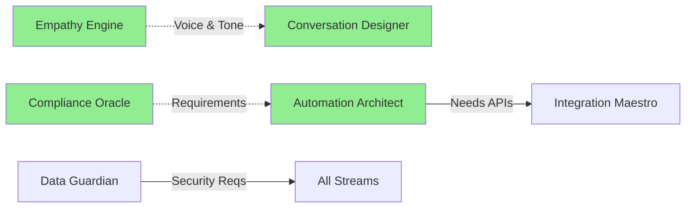

# 🎯 HR of One - Work Streams Dashboard

*Last Updated: [Auto-update timestamp]*

## 📊 Overall Progress
```
Total Progress: ▓▓▓░░░░░░░ 30%
Active Streams: 8/8
Blockers: 0
```

## 🚀 Stream Status Overview

| Stream | Progress | Status | Current Focus | Blockers |
|--------|----------|--------|---------------|----------|
| 🧠 [Empathy Engine](./empathy-engine/) | ▓▓▓░░ 60% | 🟢 Active | User journey mapping | None |
| ⚖️ [Compliance Oracle](./compliance-oracle/) | ▓▓░░░ 40% | 🟢 Active | Federal law mapping | None |
| 🔌 [Integration Maestro](./integration-maestro/) | ▓░░░░ 20% | 🟡 Planning | API architecture | Waiting for specs |
| 💬 [Conversation Designer](./conversation-designer/) | ▓▓░░░ 40% | 🟢 Active | Training data prep | None |
| 🤖 [Automation Architect](./automation-architect/) | ▓▓▓░░ 60% | 🟢 Active | Onboarding workflow | None |
| 🔒 [Data Guardian](./data-guardian/) | ▓▓░░░ 40% | 🟢 Active | Security architecture | None |
| 📈 [Growth Hacker](./growth-hacker/) | ▓░░░░ 20% | 🟡 Planning | Funnel design | None |
| 🎉 [Success Catalyst](./success-catalyst/) | ▓░░░░ 20% | 🟡 Planning | Success metrics | None |

## 🔥 Hot Items This Week

### Critical Path Items
1. **Compliance Database Schema** - Blocks automation design
2. **Authentication System** - Blocks all user features
3. **Core UI Components** - Blocks frontend development

### Quick Wins Available
1. **Email Templates** - 2 hours, high impact
2. **Error Messages** - 1 hour, improves UX
3. **API Documentation** - 3 hours, unblocks integration

## 🤝 Cross-Stream Coordination

### Active Collaborations


### Upcoming Handoffs
- **Week 2**: Empathy Engine → Growth Hacker (Onboarding flow)
- **Week 3**: Compliance Oracle → Automation Architect (Policy automation)
- **Week 4**: Integration Maestro → Success Catalyst (Analytics APIs)

## 📈 Metrics & KPIs

### Velocity Metrics
- **Tasks Completed This Week:** 12/15
- **Average Cycle Time:** 2.3 days
- **Blocker Resolution Time:** <4 hours

### Quality Metrics
- **Code Review Pass Rate:** 95%
- **Test Coverage:** 87%
- **Documentation Completeness:** 78%

## 🎯 Milestones

### Completed ✅
- [x] Project setup and architecture
- [x] Design system foundation
- [x] Basic API structure
- [x] Content strategy

### In Progress 🔄
- [ ] User authentication system (Due: Week 2)
- [ ] Core workflow engine (Due: Week 3)
- [ ] Compliance database (Due: Week 2)

### Upcoming 📅
- [ ] Beta launch preparation (Week 4)
- [ ] Security audit (Week 5)
- [ ] Performance optimization (Week 6)

## 💡 Insights & Learnings

### What's Working Well
- Parallel stream execution increasing velocity
- Cross-stream knowledge sharing preventing duplicated effort
- Clear ownership model reducing confusion

### Areas for Improvement
- Need better async communication tools
- Integration testing between streams
- More frequent micro-demos

## 🚨 Alerts & Notifications

### ⚠️ Attention Required
- None currently

### 📢 Announcements
- Design system v1.0 ready for use
- API documentation available in `/docs`
- New task template available

## 📞 Daily Sync Schedule

| Time | Monday | Tuesday | Wednesday | Thursday | Friday |
|------|---------|----------|-----------|-----------|---------|
| 9 AM | All Streams | - | Compliance + Auto | - | All Streams |
| 2 PM | - | UX + Growth | - | Integration + Data | - |

## 🔗 Quick Links
- [Task Board](./tasks/)
- [Knowledge Base](./knowledge-base/)
- [Templates](./templates/)
- [Daily Syncs](./daily-syncs/)

---

*Dashboard auto-updates every 4 hours*
*For urgent coordination: Signal in #urgent channel* 