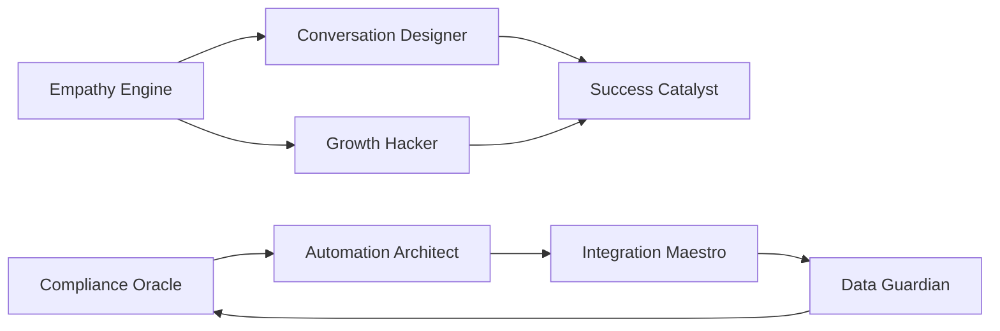

# HR of One - AI Work Streams

## 🎯 Mission
Orchestrate specialized AI streams to create the most awesome HR automation platform for small businesses and solo HR managers.

## 📊 Success Metrics
- **Time Saved**: 15+ hours/week per user
- **User Satisfaction**: 4.9+ rating
- **Compliance Score**: 100% regulation coverage
- **Onboarding Time**: <48 hours to full value

## 🧠 Active Work Streams

### 1. [Empathy Engine](./empathy-engine/README.md)
**Lead:** AI-UX Specialist
**Focus:** Human-centered design and delightful user experiences
**Status:** 🟢 Active

### 2. [Compliance Oracle](./compliance-oracle/README.md)
**Lead:** AI-Legal Expert
**Focus:** Real-time regulatory compliance and monitoring
**Status:** 🟢 Active

### 3. [Integration Maestro](./integration-maestro/README.md)
**Lead:** AI-Systems Architect
**Focus:** Seamless third-party integrations
**Status:** 🟢 Active

### 4. [Conversation Designer](./conversation-designer/README.md)
**Lead:** AI-NLP Specialist
**Focus:** Natural employee self-service interactions
**Status:** 🟢 Active

### 5. [Automation Architect](./automation-architect/README.md)
**Lead:** AI-Process Engineer
**Focus:** Workflow optimization and automation
**Status:** 🟢 Active

### 6. [Data Guardian](./data-guardian/README.md)
**Lead:** AI-Security Expert
**Focus:** Data protection and privacy compliance
**Status:** 🟢 Active

### 7. [Growth Hacker](./growth-hacker/README.md)
**Lead:** AI-Marketing Specialist
**Focus:** User acquisition and conversion optimization
**Status:** 🟢 Active

### 8. [Success Catalyst](./success-catalyst/README.md)
**Lead:** AI-Success Manager
**Focus:** Customer retention and satisfaction
**Status:** 🟢 Active

## 🔄 Coordination Protocol

### Daily Sync
- **Time:** Start of each work cycle
- **Format:** Async status updates in `/workstreams/daily-syncs/`
- **Contents:** Progress, blockers, cross-stream dependencies

### Knowledge Sharing
- **Central KB:** `/workstreams/knowledge-base/`
- **Update Frequency:** Real-time as insights emerge
- **Categories:** Patterns, User Insights, Technical Solutions, Best Practices

### Cross-Stream Collaboration


## 📈 The Awesome Formula
```
Awesome Score = (Time Saved × Stress Reduced × Compliance Confidence) / Implementation Complexity
```

Current Score: **0** (Baseline - Let's improve this!)

## 🚀 Quick Start for New Streams

1. Review your stream's README in `./[stream-name]/README.md`
2. Check current tasks in `./[stream-name]/tasks/`
3. Update progress in `./[stream-name]/progress.md`
4. Share insights in `./knowledge-base/`
5. Coordinate with related streams

## 🎨 Stream Color Codes
- 🟢 Active and progressing
- 🟡 Needs attention
- 🔴 Blocked
- 🔵 In review
- ⚪ Not started

## 📝 Templates
- [Task Template](./templates/task-template.md)
- [Progress Report Template](./templates/progress-template.md)
- [Integration Spec Template](./templates/integration-template.md)

---

*"Specialized excellence orchestrated into seamless brilliance"* 🌟 