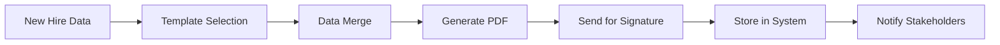
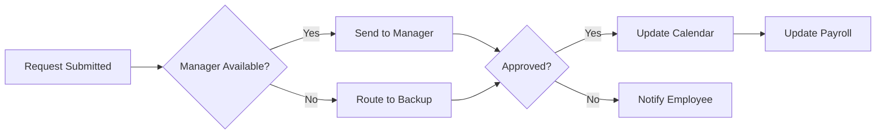

# 🤖 Automation Architect Work Stream

## Mission
Transform repetitive HR tasks into intelligent workflows that run themselves, giving time back to humans.

## Key Objectives
1. **Zero-Touch Processes**: Fully automate routine HR tasks
2. **Smart Workflows**: Self-adapting processes that improve over time
3. **Predictive Actions**: Anticipate needs before they arise
4. **Seamless Handoffs**: Smooth transitions between automated and human tasks

## Current Focus Areas

### 🔄 Core Workflow Automation
- [ ] Employee onboarding flow (offer → first day)
- [ ] Time-off request processing
- [ ] Document generation & distribution
- [ ] Benefits enrollment automation
- [ ] Offboarding checklist execution

### 📊 Process Intelligence
- [ ] Workflow analytics dashboard
- [ ] Bottleneck detection system
- [ ] Process optimization recommendations
- [ ] ROI tracking for automations

### 🧩 Integration Framework
- [ ] Webhook system for external triggers
- [ ] API gateway for third-party services
- [ ] Event-driven architecture
- [ ] Workflow orchestration engine

### 🎯 Smart Triggers
- [ ] Calendar-based automations
- [ ] Condition-based workflows
- [ ] ML-powered predictions
- [ ] Anomaly detection alerts

## Key Deliverables

### Week 1-2
1. **Workflow Engine Architecture** - Scalable automation platform
2. **Core HR Workflows** - 10 most common processes mapped
3. **Integration Framework** - Connect with external systems

### Week 3-4
1. **Process Analytics** - Measure automation effectiveness
2. **Smart Routing System** - Intelligent task assignment
3. **Workflow Builder UI** - Visual automation designer

## Technical Architecture
```yaml
workflow_engine:
  - Apache Airflow or Temporal
  - Node-RED for visual workflows
  - Bull queue for job processing

event_system:
  - Apache Kafka for event streaming
  - Redis for real-time triggers
  - PostgreSQL for workflow state

integrations:
  - Zapier-style connector system
  - OAuth2 for secure connections
  - Webhook management system
```

## Automation Patterns

### 1. Document Generation Flow


### 2. Time-Off Approval


## Success Metrics
- Tasks Automated: 80% of routine work
- Time Saved per User: 15+ hours/week
- Error Rate: <0.1%
- User Adoption: >90%

## Cross-Stream Dependencies
- **Compliance Oracle**: Ensure automated processes are compliant
- **Integration Maestro**: Connect with external systems
- **Empathy Engine**: Make automation feel helpful, not robotic

## Automation Library

### Ready Templates
1. **Onboarding Workflow** - 23 steps automated
2. **PTO Management** - Request to approval in minutes
3. **Document Distribution** - Smart routing and tracking
4. **Compliance Reminders** - Never miss a deadline

### In Development
1. **Performance Review Automation**
2. **Compensation Change Workflows**
3. **Training Assignment System**
4. **Exit Interview Process**

## Best Practices
- **Human in the Loop**: Always allow manual override
- **Transparency**: Show what's being automated
- **Gradual Rollout**: Start simple, add complexity
- **Feedback Loops**: Learn from each execution

## Progress Tracking
See [progress.md](./progress.md) for daily updates.

---

*"Automate the mundane, amplify the human"* 🚀 