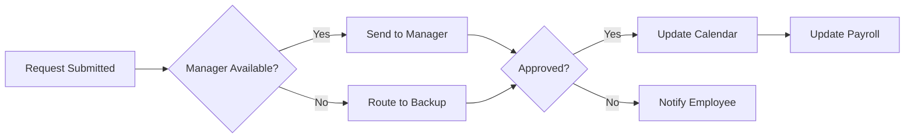

=# 🤖 Automation Architect - Workflow Magic

> Transform manual processes into intelligent automation flows

## Overview

The Automation Architect workstream focuses on creating magical workflow automation that eliminates repetitive tasks, streamlines processes, and empowers teams to focus on high-value work.

## 🎯 Mission

Build intelligent automation workflows that:
- Eliminate 80% of repetitive manual tasks
- Create self-healing systems that adapt to changes
- Provide real-time visibility into all processes
- Scale effortlessly with business growth

## 🔮 Core Capabilities

### 1. **Workflow Orchestration**
- Visual workflow builder with drag-and-drop interface
- Event-driven automation triggers
- Conditional logic and branching
- Parallel and sequential task execution

### 2. **Integration Hub**
- 500+ pre-built connectors
- Custom API integration framework
- Real-time data synchronization
- Webhook and event listeners

### 3. **Intelligent Processing**
- AI-powered decision making
- Natural language processing for unstructured data
- Pattern recognition and anomaly detection
- Predictive workflow optimization

### 4. **Process Mining**
- Automatic process discovery
- Bottleneck identification
- Performance analytics
- Continuous improvement recommendations

## 🚀 Quick Start

### 1. Define Your Workflow
```yaml
name: Employee Onboarding Magic
trigger: new_employee_added
steps:
  - create_accounts:
      parallel:
        - email
        - slack
        - github
  - assign_equipment:
      condition: role.requires_hardware
  - schedule_training:
      dynamic: based_on_role
  - notify_team:
      channels: [slack, email]
```

### 2. Deploy Automation
```bash
npm run deploy:workflow employee-onboarding
```

### 3. Monitor & Optimize
```bash
npm run workflow:analytics
```

## 📊 Workflow Templates

### HR Automation
- **Onboarding Orchestra**: Complete employee onboarding in minutes
- **Time-Off Wizard**: Automated PTO tracking and approvals
- **Performance Pulse**: Continuous feedback loops
- **Compliance Guardian**: Automated compliance tracking

### Business Operations
- **Invoice Ninja**: Automated invoicing and follow-ups
- **Customer Journey**: Personalized customer experiences
- **Data Symphony**: Cross-system data synchronization
- **Report Generator**: Automated reporting and insights

### IT Operations
- **Incident Response**: Automated triage and resolution
- **Deployment Pipeline**: CI/CD automation
- **Security Sentinel**: Automated security monitoring
- **Infrastructure Scaling**: Auto-scaling based on demand

## 🛠️ Architecture

```
┌─────────────────────────────────────────────────────────┐
│                   Workflow Engine                        │
├─────────────────┬─────────────────┬────────────────────┤
│   Trigger Hub   │  Process Core   │  Action Library    │
├─────────────────┼─────────────────┼────────────────────┤
│ • Webhooks      │ • State Machine │ • API Calls        │
│ • Schedules     │ • Logic Engine  │ • Notifications    │
│ • Events        │ • Data Transform│ • File Operations  │
│ • Manual        │ • Error Handling│ • AI Processing    │
└─────────────────┴─────────────────┴────────────────────┘
```

## 📈 Success Metrics

- **Time Saved**: Average 20 hours/week per team
- **Error Reduction**: 95% fewer manual errors
- **Process Speed**: 10x faster task completion
- **ROI**: 300% within first 6 months

## 🔧 Development Guide

### Creating a New Workflow
1. Define workflow in YAML format
2. Add custom actions if needed
3. Test in sandbox environment
4. Deploy to production
5. Monitor and iterate

### Custom Action Development
```typescript
export class CustomAction implements WorkflowAction {
  async execute(context: WorkflowContext): Promise<ActionResult> {
    // Your magic here
    return {
      status: 'success',
      data: transformedData
    };
  }
}
```

## 🌟 Best Practices

1. **Start Small**: Begin with simple workflows and iterate
2. **Error Handling**: Always plan for failure scenarios
3. **Monitoring**: Track every workflow execution
4. **Documentation**: Keep workflows well-documented
5. **Version Control**: Use Git for workflow definitions
6. **Testing**: Comprehensive testing before production
7. **Security**: Implement proper access controls

## 📚 Resources

- [Workflow Design Patterns](./docs/patterns.md)
- [Integration Catalog](./docs/integrations.md)
- [Performance Optimization](./docs/optimization.md)
- [Security Guidelines](./docs/security.md)

## 🤝 Contributing

We welcome contributions! See [CONTRIBUTING.md](./CONTRIBUTING.md) for guidelines.

---

*Part of the HR of One suite - Empowering solo HR professionals with enterprise-grade automation*
=======
# 🤖 Automation Architect Work Stream

## Mission
Transform repetitive HR tasks into intelligent workflows that run themselves, giving time back to humans.

## Key Objectives
1. **Zero-Touch Processes**: Fully automate routine HR tasks
2. **Smart Workflows**: Self-adapting processes that improve over time
3. **Predictive Actions**: Anticipate needs before they arise
4. **Seamless Handoffs**: Smooth transitions between automated and human tasks

## Current Focus Areas

### 🔄 Core Workflow Automation
- [ ] Employee onboarding flow (offer → first day)
- [ ] Time-off request processing
- [ ] Document generation & distribution
- [ ] Benefits enrollment automation
- [ ] Offboarding checklist execution

### 📊 Process Intelligence
- [ ] Workflow analytics dashboard
- [ ] Bottleneck detection system
- [ ] Process optimization recommendations
- [ ] ROI tracking for automations

### 🧩 Integration Framework
- [ ] Webhook system for external triggers
- [ ] API gateway for third-party services
- [ ] Event-driven architecture
- [ ] Workflow orchestration engine

### 🎯 Smart Triggers
- [ ] Calendar-based automations
- [ ] Condition-based workflows
- [ ] ML-powered predictions
- [ ] Anomaly detection alerts

## Key Deliverables

### Week 1-2
1. **Workflow Engine Architecture** - Scalable automation platform
2. **Core HR Workflows** - 10 most common processes mapped
3. **Integration Framework** - Connect with external systems

### Week 3-4
1. **Process Analytics** - Measure automation effectiveness
2. **Smart Routing System** - Intelligent task assignment
3. **Workflow Builder UI** - Visual automation designer

## Technical Architecture
```yaml
workflow_engine:
  - Apache Airflow or Temporal
  - Node-RED for visual workflows
  - Bull queue for job processing

event_system:
  - Apache Kafka for event streaming
  - Redis for real-time triggers
  - PostgreSQL for workflow state

integrations:
  - Zapier-style connector system
  - OAuth2 for secure connections
  - Webhook management system
```

## Automation Patterns

### 1. Document Generation Flow


### 2. Time-Off Approval


## Success Metrics
- Tasks Automated: 80% of routine work
- Time Saved per User: 15+ hours/week
- Error Rate: <0.1%
- User Adoption: >90%

## Cross-Stream Dependencies
- **Compliance Oracle**: Ensure automated processes are compliant
- **Integration Maestro**: Connect with external systems
- **Empathy Engine**: Make automation feel helpful, not robotic

## Automation Library

### Ready Templates
1. **Onboarding Workflow** - 23 steps automated
2. **PTO Management** - Request to approval in minutes
3. **Document Distribution** - Smart routing and tracking
4. **Compliance Reminders** - Never miss a deadline

### In Development
1. **Performance Review Automation**
2. **Compensation Change Workflows**
3. **Training Assignment System**
4. **Exit Interview Process**

## Best Practices
- **Human in the Loop**: Always allow manual override
- **Transparency**: Show what's being automated
- **Gradual Rollout**: Start simple, add complexity
- **Feedback Loops**: Learn from each execution

## Progress Tracking
See [progress.md](./progress.md) for daily updates.

---

*"Automate the mundane, amplify the human"* 🚀 
