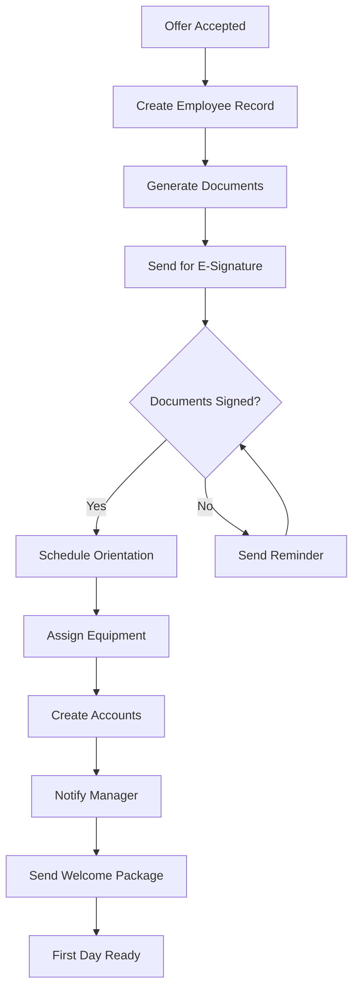

# Task: Employee Onboarding Workflow Automation

## Overview
**Stream:** Automation Architect
**Priority:** 🔴 Critical
**Estimated Effort:** 3 days
**Due Date:** 2024-01-15

## Description
Design and implement the complete employee onboarding workflow from offer acceptance to first day readiness. This workflow should handle all standard onboarding tasks automatically while allowing for company-specific customizations.

## Success Criteria
- [ ] Zero manual steps for standard onboarding (fully automated)
- [ ] All required documents generated and sent automatically
- [ ] New hire portal populated with first-day information
- [ ] Manager and IT notified of required preparations
- [ ] Compliance requirements tracked and completed
- [ ] 90% reduction in time-to-productive for new hires

## Dependencies
- **Requires:** 
  - Document template system (Empathy Engine)
  - Compliance requirements map (Compliance Oracle)
  - Email/notification system (Integration Maestro)
- **Blocks:** 
  - Customer beta testing
  - Performance metrics dashboard
- **Related Streams:** 
  - Empathy Engine (user experience)
  - Compliance Oracle (legal requirements)
  - Data Guardian (secure data handling)

## Technical Requirements
```yaml
tools:
  - Temporal or Apache Airflow for workflow orchestration
  - React Flow for visual workflow builder
  - PostgreSQL for workflow state management
  
apis:
  - Document generation API
  - E-signature integration (DocuSign/HelloSign)
  - Calendar integration (Google/Outlook)
  - HRIS integration hooks
  
skills:
  - Workflow orchestration patterns
  - State machine design
  - Error handling and retry logic
```

## Approach

### Phase 1: Workflow Mapping (Day 1)
1. Map the complete onboarding journey
2. Identify all stakeholders and touchpoints
3. Define decision points and branches
4. Create workflow diagram

### Phase 2: Core Implementation (Day 2)
1. Set up workflow orchestration engine
2. Implement core workflow steps:
   - Offer acceptance trigger
   - Document generation pipeline
   - Task assignment system
   - Notification framework
3. Build error handling and retry logic

### Phase 3: Integration & Testing (Day 3)
1. Connect to external systems
2. Implement compliance checks
3. Create monitoring dashboard
4. End-to-end testing with multiple scenarios

## Workflow Steps



## Customization Points
- Document templates per role/department
- Approval workflows based on seniority
- Equipment assignment rules
- Account provisioning by department
- Custom welcome messages

## Risks & Mitigations
| Risk | Impact | Mitigation |
|------|--------|------------|
| E-signature API downtime | High | Implement fallback to manual process |
| Complex approval chains | Medium | Build flexible routing engine |
| Data privacy concerns | High | Encrypt all PII, audit trail |
| Integration failures | Medium | Retry logic, manual override |

## Monitoring & Analytics
- Time from offer to day-one ready
- Document completion rates
- Bottleneck identification
- Error rates by step
- User satisfaction scores

## Notes
- Consider building a "preview mode" for HR managers
- Allow templates for different employee types (FT, PT, Contractor)
- Include rollback capabilities for cancelled hires
- Mobile-friendly new hire experience is critical

---
**Status:** 🟡 In Progress
**Assigned:** Automation Architect AI
**Created:** 2024-01-10
**Updated:** 2024-01-10

## Progress Log
- [2024-01-10] Task created, requirements gathered
- [2024-01-10] Started workflow mapping phase 