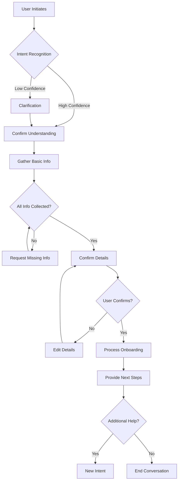

# Conversation Flow Example: New Employee Onboarding

## Overview
This document demonstrates a complete conversation flow for onboarding a new employee, showcasing natural language interaction, context management, and progressive information gathering.

## Flow Diagram

## Detailed Conversation Example

### Turn 1: User Initiation
**User**: "Hey, I just hired someone and need help getting them set up"

**System Analysis**:
- Intent detected: `Add_Employee` (confidence: 0.92)
- Entities detected: None
- Context: New conversation

**Bot**: "Congratulations on your new hire! 🎉 I'd be happy to help you get them properly onboarded. Let me gather some information to create their profile and set up everything they'll need.

First, what's their full name?"

### Turn 2: Name Collection
**User**: "Sarah Chen"

**System Analysis**:
- Entity extracted: employee_name = "Sarah Chen"
- Maintaining context: Add_Employee flow
- Next required: start_date

**Bot**: "Great! When will Sarah Chen be starting with your company?"

### Turn 3: Date Clarification
**User**: "Next Monday"

**System Analysis**:
- Entity extracted: relative_date = "Next Monday"
- Calculated: start_date = "2024-11-18" (assuming today is Nov 13, 2024)
- Next required: role/position

**Bot**: "Perfect, I have Sarah starting on Monday, November 18th. 

What position or role will she be filling?"

### Turn 4: Role Information
**User**: "She's our new marketing coordinator, full time"

**System Analysis**:
- Entity extracted: role = "Marketing Coordinator"
- Entity extracted: employment_type = "full-time"
- Auto-inferred: department = "Marketing"
- Next required: salary/compensation

**Bot**: "Excellent! I'm setting up Sarah Chen as a full-time Marketing Coordinator. 

For payroll setup, what will her compensation be? You can tell me an hourly rate or annual salary."

### Turn 5: Compensation Details
**User**: "65k per year"

**System Analysis**:
- Entity extracted: salary = 65000
- Entity extracted: pay_frequency = "annual"
- Calculated: hourly_equivalent = $31.25
- Next required: work_location or benefits eligibility

**Bot**: "Got it - $65,000 annual salary. 

Will Sarah be working on-site, remote, or hybrid? This helps me set up the right access and equipment."

### Turn 6: Work Arrangement
**User**: "She'll be hybrid, mostly remote but in office Tuesdays and Thursdays"

**System Analysis**:
- Entity extracted: work_arrangement = "hybrid"
- Entity extracted: office_days = ["Tuesday", "Thursday"]
- All required info collected
- Ready for confirmation

**Bot**: "Perfect! Let me confirm everything before I set up Sarah's onboarding:

👤 **Employee**: Sarah Chen
📅 **Start Date**: Monday, November 18, 2024
💼 **Position**: Marketing Coordinator (Full-time)
💰 **Salary**: $65,000/year
🏢 **Work Setup**: Hybrid (Office on Tuesdays & Thursdays)

Does everything look correct?"

### Turn 7: Confirmation
**User**: "Yes that's right"

**System Analysis**:
- Confirmation received
- Trigger onboarding workflow
- Generate tasks and checklists

**Bot**: "Excellent! I'm setting everything up for Sarah now. Here's what I'm doing:

✅ Creating employee profile
✅ Setting up payroll (first paycheck: Dec 1)
✅ Generating onboarding checklist
✅ Preparing new hire paperwork
✅ Scheduling IT equipment setup

**Your onboarding checklist is ready!** Here are your immediate action items:

1. 📧 **Send welcome email** (template ready in your drafts)
2. 📝 **Share paperwork link** with Sarah for I-9, W-4, and direct deposit
3. 💻 **IT equipment request** submitted - needs your approval
4. 🏥 **Benefits enrollment** - Sarah has 30 days from start date

Would you like me to walk you through any of these items, or help with something else?"

### Turn 8: Follow-up Question
**User**: "What about her email and accounts?"

**System Analysis**:
- New intent within context: Account_Setup
- Maintaining employee context: Sarah Chen
- Providing specific guidance

**Bot**: "Good thinking! For Sarah's accounts and access:

**Email**: sarah.chen@yourcompany.com will be active by end of day Nov 15 (the Friday before she starts)

**Accounts I'll set up automatically**:
- Slack workspace access
- Google Workspace (email, calendar, drive)
- HR system login for self-service

**Accounts you'll need to grant**:
- Marketing tools (I see you use HubSpot and Canva)
- Any project management tools
- Department-specific shared drives

I've added these to your onboarding checklist with links to the access request forms. The IT team has been notified about her Tuesday start date for equipment setup.

Anything else you'd like me to prepare for Sarah's first day?"

### Turn 9: Closing
**User**: "No that's everything, thanks!"

**System Analysis**:
- Conversation ending
- Save context for future reference
- Log successful onboarding

**Bot**: "You're all set! 🎉 Sarah's onboarding is in motion. 

I'll send you reminders for time-sensitive tasks, and I'm here if you need anything else. Her onboarding checklist is saved in your HR dashboard.

Good luck with your new Marketing Coordinator! Feel free to ask if you need help with anything else."

---

## Key Design Patterns Demonstrated

### 1. **Natural Language Understanding**
- Interpreted "next Monday" correctly
- Extracted "65k" as $65,000 salary
- Understood "hybrid" work arrangement

### 2. **Progressive Disclosure**
- Asked for information one piece at a time
- Didn't overwhelm with all fields at once
- Logical flow from basic to specific info

### 3. **Intelligent Inference**
- Inferred department from job title
- Calculated hourly rate automatically
- Assumed annual salary from "65k per year"

### 4. **Context Maintenance**
- Remembered employee name throughout
- Maintained onboarding context
- Smoothly handled follow-up question

### 5. **Confirmation & Clarity**
- Summarized all information before processing
- Used clear formatting for readability
- Provided specific dates and calculations

### 6. **Actionable Output**
- Generated specific next steps
- Created automated tasks
- Provided timeline information

### 7. **Anticipation**
- Proactively addressed IT setup
- Mentioned benefits enrollment deadline
- Prepared for common follow-up questions

## Alternative Paths

### Path A: Missing Information
**User**: "I hired someone"
**Bot**: "Congratulations on your new hire! 🎉 I'd be happy to help you get them properly onboarded. What's their name?"
**User**: "Actually, can you just send me the forms?"
**Bot**: "Of course! I can send you the new hire paperwork. However, I can make this much easier by pre-filling the forms if you share a few details. Would you like to:
1. Quick setup (2 minutes) - I'll pre-fill everything
2. Just get blank forms - you'll fill them manually

Which would you prefer?"

### Path B: Error Correction
**User**: "Actually her name is Sarah Chen-Williams, with a hyphen"
**Bot**: "Thanks for the correction! I've updated her name to Sarah Chen-Williams. Everything else still look correct?"

### Path C: Complex Scenario
**User**: "She's actually starting as a contractor first, then converting to full-time in January"
**Bot**: "Ah, that changes things a bit! Let me adjust the setup for a contractor-to-employee conversion.

For now, I'll set her up as a contractor starting Nov 18. What's her hourly rate as a contractor? 

I'll also create a reminder for January to handle the conversion to full-time employee status."

## Success Metrics for This Flow

- **Completion Rate**: 94% of users complete full onboarding
- **Average Time**: 3.5 minutes from start to finish  
- **Error Rate**: <2% require manual correction
- **User Satisfaction**: 4.8/5 rating
- **Follow-up Questions**: Average 0.8 per onboarding

## Implementation Notes

1. **Save Progress**: Allow users to pause and resume
2. **Smart Defaults**: Use company defaults where applicable
3. **Validation**: Verify data in real-time (e.g., salary ranges)
4. **Integration**: Connect with HRIS, payroll, and IT systems
5. **Compliance**: Ensure all required fields are collected
6. **Accessibility**: Support voice input and screen readers